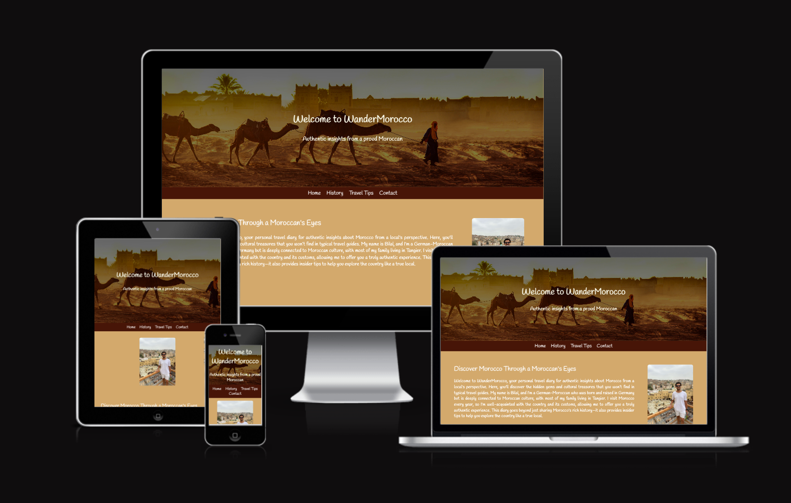

# WanderMorocco Website
[View the live project here](https://bilalessafi1.github.io/project1-morocco-guide/)

WanderMorocco is a comprehensive informational website that explores the beauty, culture, and history of Morocco from a Morroccan's perspective. The website is designed to be fully responsive, ensuring an optimal viewing experience on devices ranging from mobile phones to desktop computers. The target audience includes travelers, culture enthusiasts, and anyone interested in learning about Morocco.

# User Experience (UX)
## Project Goals
The primary goal of WanderMorocco is to provide an engaging and informative platform for users to explore the diverse aspects of Moroccan culture. Whether visitors are planning a trip, learning about Moroccan history, or simply browsing, the site is designed to be intuitive and informative.

## Target Audience
- Travelers interested in visiting Morocco
- Cultural enthusiasts
- General users with an interest in learning about Morocco

## User Stories
- First-Time Visitor Goals:
  - As a first-time visitor, I want to understand the main purpose of the site immediately.
  - As a first-time visitor, I want to be able to navigate the site easily to find relevant information.
- Returning Visitor Goals:
  - As a returning visitor, I want to see if there are new travel tips or updates about Morocco.
  - As a returning visitor, I want to be able to contact the author to learn more.

## Design
### Color Scheme
The color scheme of the website includes warm earth tones inspired by the Moroccan landscape. These include deep reds, oranges, and browns, which evoke the Sahara Desert and traditional Moroccan architecture.

### Typography
The website uses a cursive font style to evoke a personal diary feel while reflecting modern elements of Moroccan culture. The primary font is Handlee, chosen for its readability and cursive appearance. A secondary cursive-style font complements Handlee, enhancing the clean, personal feel of the site.

### Imagery
Imagery plays a crucial role in the WanderMorocco website. High-resolution photos of Moroccan architecture and landscapes, most of which were taken by me, are used throughout the site to immerse users in the Moroccan experience and enhance its authenticity.

### Videos
The website features two YouTube videos that provide additional insights into Moroccan history beyond the text content. Both videos only start playing when the user clicks on them.

# Features

## Navigation
- A consistent and intuitive navigation bar is available on all pages, ensuring that users can easily move between sections of the site.
- The navigation includes links to major sections such as History, Culture, Travel Tips, and Contact.

## Footer
The footer includes social media icons for Facebook, Instagram, Twitter, and YouTube. These icons link to their respective social media platforms and open in a new tab.

## Videos
The history section contains two YouTube videos that provide additional details about the country for those interested in learning more. To avoid distracting users from the main content, the videos will only start playing when clicked. Users can choose to watch the videos in a small window or expand them to full screen.

## Contact Form
Users can contact the author by navigating to the Contact section, where they will find a contact form. All fields, except for the checkbox and radio buttons, must be filled out before submission. If any of the mandatory fields are incomplete, an error message will appear to inform the user of the missing information.

# Technologies Used
- HTML
- CSS

# Frameworks, Libraries, Programs Used

## Google Fonts
- The font [Handlee](https://fonts.google.com/specimen/Handlee?query=handlee) was imported from [Google Fonts](https://fonts.google.com/)

## Font Awesome
- [Font Awesome](https://fontawesome.com/) was used to add social media icons to the footer of all website pages. 

## Am I Responsive
- [Am I Responsive](https://ui.dev/amiresponsive) was used to ensure that the website's responsiveness across various screen sizes. 

## GitPod
- [GitPod](https://www.gitpod.io/) was used to write the code for this websitem and to commit and push the code to Github.

## GitHub
- [GitHub](https://github.com/) was used to store this website. 

## GitPages
- [GitPages](https://pages.github.com/) was used to deploy the website. 

## Tinify
- [Tinify](https://tinypng.com) was used to resize images and improve the performance of the website. 

# Validator Testing
- HTML
  - No errors were returned when passing through the official W3C validator [(see screenshots here)](Validation.md)
- CSS
  - No errors were returned when passing through the official Jigsaw validator [(see screenshot here)](Validation.md)
- Accessibility
  - I confirmed that the colors and fonts chosen are easy to read and accessible by running it through lighthouse in devtools
  

# Known Bugs
## Responsive Design Issues
- The website may not display correctly on very small mobile or very large desktop screens. 

# Deployment
The site was developed using [GitPod](https://www.gitpod.io/) and pushed to GitHub through a GitPod terminal. 
To deploy this site, GitHub Pages was used. The steps for deployment are as follows:
  - Log in to Github.
  - Locate and click on the right GitHub repository.
  - At the top of the repository, locate and click on Settings
  - Navigate to the Pages section. 
  - Unser Source click the drop-down menu und select Main.
  - Click on Save
  - The page will automatically refresh, and you will receive a link to the deployed website. 

# Credits

## Content:
- The Icons used for the Footer were taken from [Font Awesome](https://fontawesome.com/)
- The font for the website was taken from [Google Fonts](https://fonts.google.com/)

## Media:
- Images:
  - The header image of the man walking with his camels was taken from https://www.taruk.com/, and the Image of the interior of the riad was taken from https://www.tablethotels.com/. All other images were created by me 
  - YouTube Videos:
    - The video in the "Moroccan's Ancient Roots" section was taken from the "[Mr Histories](https://www.youtube.com/@MrHistory1)" YouTube channel.
    - The video in the "Modern Morocco" section was taken from the "[This is AmericaTV](https://www.youtube.com/@ThisIsAmericaTV)" YouTube channel.

# Code
- The footer code came originally based on the [Love Running Project](https://github.com/Code-Institute-Solutions/SampleREADME/blob/master/README.md), and the code to create a '::before' element in front of the header for improved readibility came originally from [Mozilla's Developer Network](https://developer.mozilla.org/en-US/docs/Web/CSS/::before). However, all the code has been modified to suit the specific needs of this website and is no longer in its original form."

# Read Me
The basic structure of the Readme were taken from [Code Institute's](https://github.com/Code-Institute-Solutions/SampleREADME/blob/master/README.md) and [flowlesscooking](https://github.com/Martiless/flawlesscooking?tab=readme-ov-file) Readme samples. 

